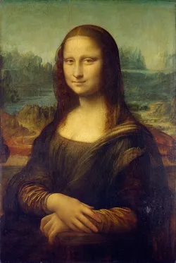

# ECE 558- Digital Imaging Systems
# Image-Blending

Image Blending using Gaussian and Laplacian Pyramid techniques

## Steps:
## Image Masking:
  - Align foreground and background images
  - GUI to create mask on the foreground image of following shapes:
    - ellipse
    - rectangle
    - free shape
## Blending:
  - Generating gaussian pyramid of both foreground and background image
  - Generating laplacian pyramid of both images of gaussian (fL, bL)
  - Generating gaussian pyramid of the mask (mG)
  - Generating blended image using fL, bL, and mG
  

foreground image           |  background image |  blended image
:-------------------------:|:-------------------------: |:-------------------------:
  |   | 

    
 
